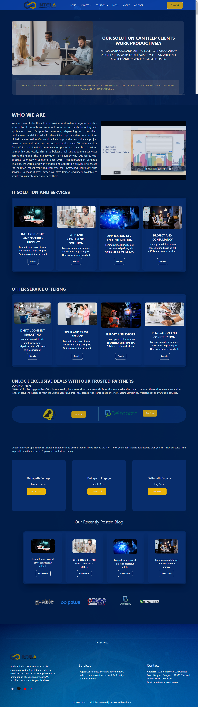
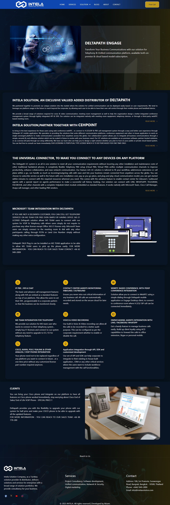
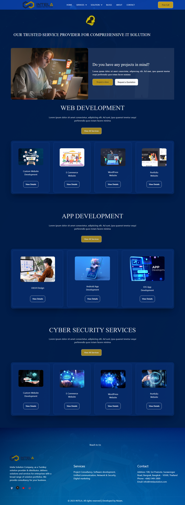

# React + Vite

Projects Name: Intela

## Table of contents

- [Overview](#overview)
  - [Screenshot](#screenshot)
  - [Links](#links)
- [My process](#my-process)
  - [Built with](#built-with)
  - [What I learned](#what-i-learned)
  - [Continued development](#continued-development)
  - [Follow Me](#follow-me)
- [Author](#author)
- [Acknowledgments](#acknowledgments)

## Overview

This projects creates for RIG Group.
Technology: HTML, Tailwind CSS, daisyui, React js.

### Screenshot





### Links

- Live Site URL: [Live Link](https://react-intela.netlify.app/)

## My process

### Built with

- React js
- Tailwind CSS, daisyui
- HTML
- AOS Animation
- React Router DOM
- React-helmet-async

### What I learned

```html

```

```css
.proud-of-this-css {
  color: papayawhip;
}
```

```js
const proudOfThisFunc = () => {
  console.log("🎉");
};
```

### Follow Me

- Website - [Freelancer Nizam](https://www.nizam2020.com)
- Frontend Mentor - [@freelancernizamc](https://www.frontendmentor.io/profile/freelancernizamc)
- Twitter - [@freelancernizam](https://www.twitter.com/freelancernizam)

### Author

- Md. Nizam Uddin ,
- Web Developer,
- WhatsApp: +8801819968181
